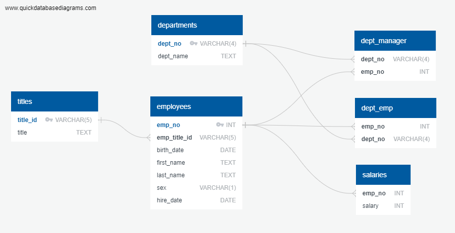

# Challenge 9 - SQL

## Data Modeling

## Data Engineering
The schemas for creating the six tables in the data base can be found in [`schema.sql`](EmployeeSQL/schema.sql).

- `dept_no` and `title_id`/`emp_title_id` and `sex` are VARCHARs because they have a fixed length.
- All other strings are TEXT because they could have a variable length.
- `first_name`, `last_name`, could potentially be NULL as there is no guarantee that a person has a name[^1]. However, for this data set, I will be using NOT NULL.

## Data Analysis
The queries to get answers to the data analysis lists are found in [`queries.sql`](EmployeeSQL/queries.sql)

Number of results for each query

1. 300,024
2. 36,150
3. 24
4. 331,603
5. 20
6. 52,245
7. 137,952
8. 1,638
    - All last names appeared between 145 ('Sadowsky') and 226 ('Baba') times except 'Foolsday' which appeared only once.

---

## References
[^1]: [Falsehoods Programmers Believe About Names – With Examples](https://shinesolutions.com/2018/01/08/falsehoods-programmers-believe-about-names-with-examples/)
